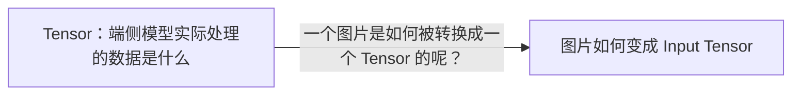

# 知识生长脉络

```mermaid
flowchart LR
  R1["Tensor：端侧模型实际处理的数据是什么"]
  R2["图片如何变成 Input Tensor"]
  R1 -->|"一个图片是如何被转换成一个 Tensor 的呢？"| R2
```

## 记录索引

- [Tensor：端侧模型实际处理的数据是什么](records/Tensor基础.md)
- [图片如何变成 Input Tensor](records/图片如何变成Input Tensor.md)

> 这是一份从 LearningRecord `relations` 派生的阅读视图，不是关系事实的第二份来源。
